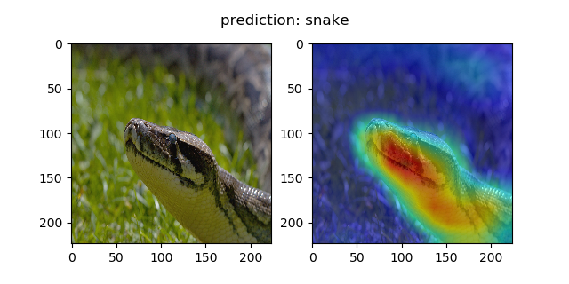

# transfer-learning-snake-detection

 

    
    
    
    

 

An exercise in using transfer learning techniques and generating gradient CAMs (class activation maps). Used the VGG-16 architecture pre-trained on ImageNet data to help extract features. 
