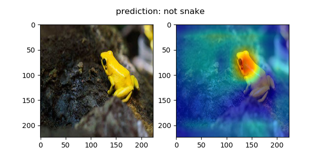
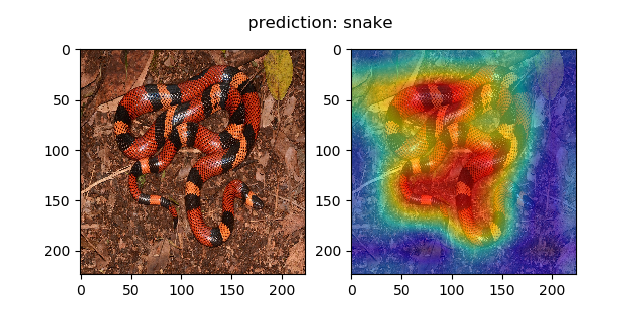
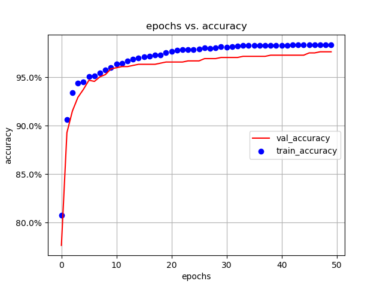
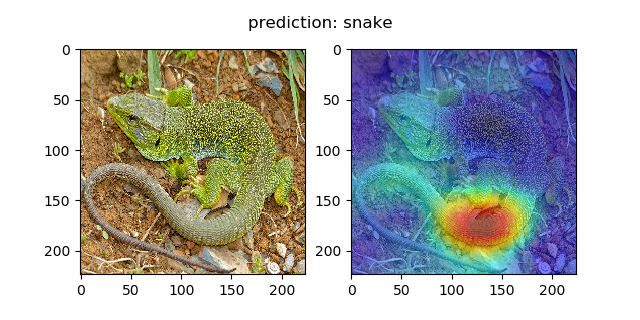

# transfer-learning-snake-detection

 

    
    
    
    

 

An exercise in using transfer learning techniques and generating gradient CAMs (class activation maps). 

## Transfer Learning Summary

Used the VGG-16 architecture pre-trained on ImageNet. Took the pre-trained model's feature extracting layers and attached customized pooling and fully connected layers. 
Froze the convolutional layers from receiving optimization by disabling automatic gradient calculations. Then trained on 3.4k images (75% training, 25% validation) labeled as containing a snake or not that was collected from Azure's Bing Image Search API using a custom python package I developed a while ago. Max I trained for was about 50 epochs worth (around 3 hours with my GPU), which resulted in around 98.4% training accuracy and 97.6% validation accuracy, so there was some overfitting as shown in the graphs:

 

    
    

 

## Gradient CAMs

The book I was reading from covered how to make class activation maps, which highlight the pixels of the image that were used to come up with the class prediction.
This is done by taking the mean of the intermediate activations in the convolutional layers and multiplying it by the computed gradients for a specific class. 
There's more to it than I could explain, but the process isn't too hard to program in PyTorch. Here is a sample gradient CAM heatmap generated which highlights the
features used by the model to predict the class "snake" for this image of a snake: 

 

    

 

Here is a heatmap for the prediction "not snake" for this image of a frog: 

 

    

 

Here is a heatmap but this time for the erroneous prediction "snake" for a picture of a lizard: 

 

    

 

You can see that the model thought that the tail of the animal indicated a relation to the snake class. Obviously it is not the case, so more tuning could be used for the model.
There are more CAMs in the save folder.
